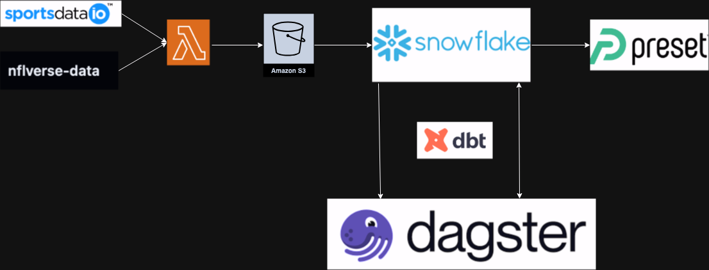
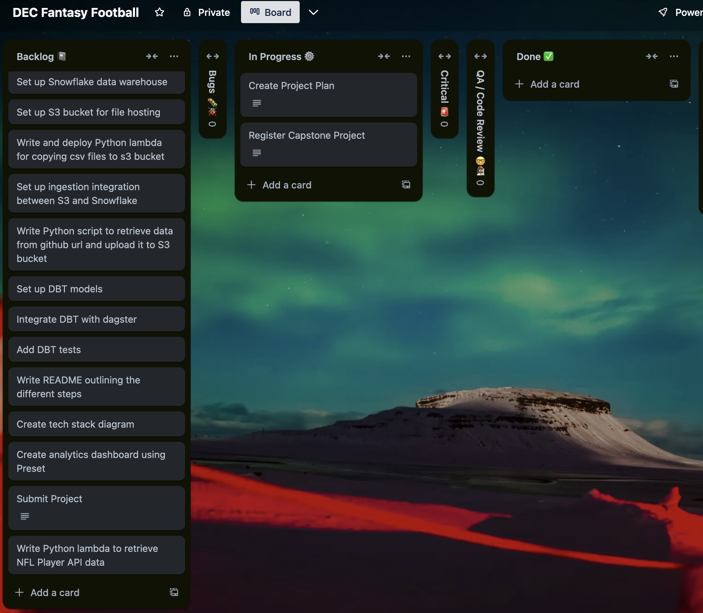

# Project plan

## Objective

This project aims to take existing play-by-play nfl data and create an ELT pipeline that automatically ingests existing and new csv and parquet files and transforms the raw data into modeled data that can be consumed for analytics via a tool like Preset and more easily accessed for data analysis via SQL and Python. 

## Consumers

Anyone who wants more direct access to historical game and season data in the NFL as either a football or fantasy football fan will find this data useful. The nature of the data is such that with the right transformations, it'll be possible to answer questions that address not just specific game and season(s)-long stats for particular players, but league-wide trends as a whole.

## Questions

Given that this project aims to source play-by-play data dating back to 1999, many kinds of questions can be answered about the evolution and history of the game of football over the past 25 years, including many fantasy-relevant statistics. 

Examples include:
- Who was/were the rushing/passing yards leader(s) for any given season?
- How has the number of average rushing yards per game by team changed over the past 10 years?
- How does QB EPA change in relation to win probability in the 4th quarter?
- What percentage of the time do teams with different types of 1-score leads (2-8 points) at halftime win the game outright?
 

## Source datasets

| Source name | Source type | Source documentation |
| - | - | - |
| SportsDataIO | JSON API | - |
| NFL Play-By-Play Github Repo | CSV/Parquey | - |

## Solution architecture
This project will leverage AWS, Dagster Cloud, dbt, and Snowflake. The raw ingestion data will be consumed via an S3 lambda, running every week to check for new data

After being ingested into Snowflake, the data will be transformed via dbt, orchestrated through Dagster Cloud.

Finally, the data will be made available for consumption through Preset.

Github will be used for hosting all custom code.

## Breakdown of tasks

